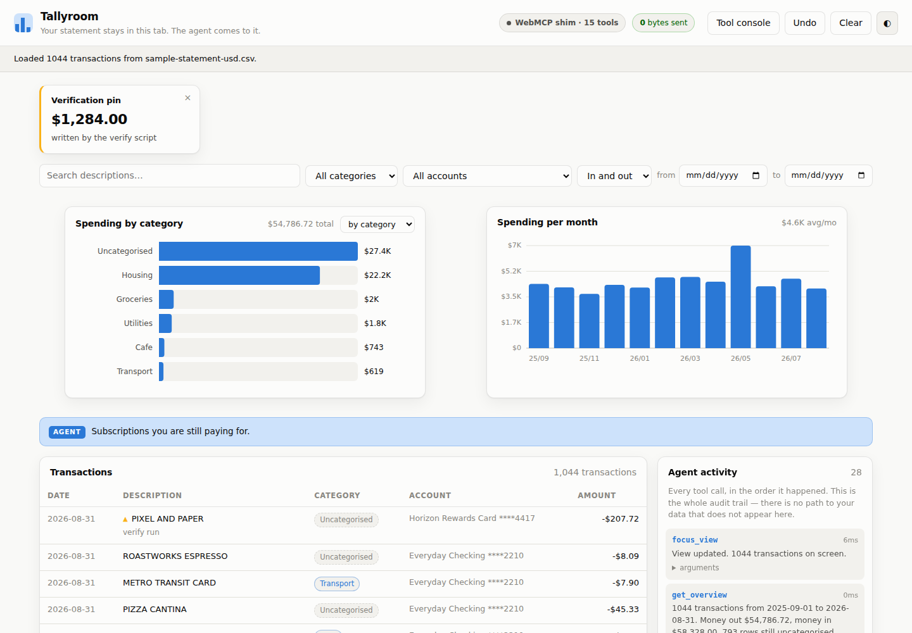

# Tallyroom

**A private money workbench your agent can use — without your statement ever leaving the tab.**

Built for the [OpenAI WebMCP Challenge](https://openai.com/webmcp-challenge/).

| | |
|---|---|
| **Live app** | https://pineapplesour.github.io/tallyroom/ |
| **Try it instantly** | https://pineapplesour.github.io/tallyroom/?sample |
| **Licence** | MIT |
| **Dependencies** | none at runtime — plain ES modules, plain SVG, static files |



---

## The argument

A cloud agent can only help with your finances if you first hand your finances to the cloud. A conventional MCP server for bank data has to receive the data to work on it: you upload the statement, or you hand over read access to the account. Most people, entirely sensibly, will not do that. So the single most obvious use for a personal assistant is also the one almost nobody uses.

WebMCP inverts the direction of travel. The page holds the data. The page registers the tools. The agent arrives, calls the tools, and gets back answers — never rows it did not ask for, and never a file. Your statement stays where you put it.

**The data does not go to the agent. The agent comes to the data.**

That inversion is the whole project. Everything below is in service of making it real rather than rhetorical.

---

## What it does

Drop a CSV export from a bank or card issuer onto the page. Tallyroom parses it in the browser and gives you a workbench: charts, a filterable table, categorisation rules, budgets. Nothing is uploaded, and there is no account to create.

Then an agent in a WebMCP-capable browser can use the same workbench:

> **You:** what subscriptions am I still paying for, and did any of them go up?
>
> The agent calls `find_recurring`. The page clusters 1,044 rows into merchants, tests the gaps between charges for weekly / monthly / quarterly / yearly regularity, and compares each subscription's early charges against its recent ones. It comes back with nine recurring charges, their annualised cost, and one price rise: **Streamly, $15.99 → $18.99, +18.8%.**
>
> The agent then calls `focus_view` to filter your screen to those charges, and `pin_insight` to leave the total on the board.

Twelve months of statement, three tool calls, and the screen you are looking at agrees with the answer you were given.

---

## How WebMCP is used

### Registration

Tools are registered on `document.modelContext`, with `navigator.modelContext` accepted as a fallback since both spellings are in circulation. From [`src/tools.js`](src/tools.js):

```js
await mc.registerTool({
  name: "find_recurring",
  description:
    "Detect charges that repeat on a schedule - subscriptions, rent, memberships - by " +
    "clustering merchants and testing the gaps between charges for weekly, monthly, " +
    "quarterly or yearly regularity. Reports the typical amount, the annualised cost, " +
    "and any price change between the early and recent charges, which is how a quiet " +
    "price rise gets caught.",
  inputSchema: {
    type: "object",
    properties: {
      minOccurrences: { type: "number", description: "How many charges before something counts as recurring. Defaults to 3." },
    },
  },
  annotations: {
    readOnlyHint: true,
    destructiveHint: false,
    idempotentHint: true,
    openWorldHint: false,      // literally true here: no tool can reach the network
  },
  execute(input = {}) { /* ... */ },
}, { signal: controller.signal });
```

Every tool is registered with an `AbortSignal`, which is how tools are unregistered later.

### The 15 tools

Eight read, seven write. Two more appear at runtime — see the next section.

| Tool | | What it does |
|---|---|---|
| `get_overview` | reads | Start here. What is loaded, the totals, how much is still uncategorised, what the person is looking at, and the egress meter. |
| `query_transactions` | reads | Individual rows matching a filter. Capped at 500 rows, but the totals always cover every match. |
| `summarize_spending` | reads | Group and total by category, merchant, month, account or day. |
| `get_trend` | reads | A month-by-month series, optionally for one category or merchant. |
| `list_merchants` | reads | Collapses branch names, reference numbers and spelling variants into merchant clusters. 1,044 rows become 45 decisions. |
| `find_recurring` | reads | Subscriptions and other scheduled charges, with annualised cost and price changes. |
| `find_anomalies` | reads | Outliers against a merchant's own history, duplicate charges, and unusually large one-offs. |
| `check_budgets` | reads | Budget versus actual, month by month. |
| `load_sample_data` | writes | Loads the synthetic statement that ships with the app. |
| `focus_view` | writes | Filters, sorts and highlights **what the person sees**, and leaves a message above the table. |
| `propose_categories` | writes | Stages categorisation rules for human approval. Cannot apply them. |
| `set_transaction_category` | writes | A manual override on a small, explicit list of ids. |
| `set_budget` | writes | Sets or clears a monthly budget. |
| `annotate_transaction` | writes | Attaches a note, and optionally a flag, to one row. |
| `pin_insight` | writes | Puts a finding on the board so it outlives the conversation. |

### Dynamic registration: the approval gate

An agent cannot bulk-recategorise your statement. `propose_categories` *stages* the rules; the page renders exactly what would change and how many rows each rule touches; a human presses the button.

While something is staged, two extra tools exist:

```js
export async function registerStagingTools() {
  for (const def of STAGING_TOOLS) await register(mc, def);   // apply_staged_changes, discard_staged_changes
}
export function unregisterStagingTools() {
  for (const def of STAGING_TOOLS) unregister(def.name);      // controller.abort()
}
```

So the tool list an agent sees is a function of the state of the page, which is what `toolchange` is for. Open the tool console, stage a change, and watch the list grow from 15 to 17 and back.

This is also the trust boundary. The dangerous verb is not "read my statement" — it is "silently rewrite a thousand rows". That verb is not available to the agent.

### The agent drives the screen, not a hidden copy

`focus_view` is the same code path as clicking a filter chip. There is no agent-only view of the data and no parallel API that can drift away from the UI. If the agent filtered the table, the person is looking at the filtered table. Every tool call also lands in the **Agent activity** panel with its arguments and result, so the audit trail is not a feature you have to go and find.

### Result discipline

Tool results are capped and summarised, because an agent's context is a scarce resource:

- `query_transactions` returns at most 500 rows (50 by default) but the aggregate always covers every match, so "how much did I spend on coffee" costs one small result rather than a thousand rows.
- `list_merchants` exists so that categorising a year of spending is ~45 decisions instead of ~1,044.
- Every result is a JSON object whose first key is a plain-English `summary`, so a model that reads nothing else still has the answer.

---

## Privacy, measured rather than promised

The claim "your data never leaves the tab" is worth nothing if you have to take it on faith. So the page measures itself.

[`src/privacy.js`](src/privacy.js) wraps `fetch`, `XMLHttpRequest`, `sendBeacon` and `WebSocket` before any application code runs. Anything cross-origin, and anything carrying a body, is **refused** — not merely counted. Requests for the app's own files are counted separately and labelled. The result is the counter in the header, which reads `0 bytes sent` and stays there, and which `get_overview` also reports to the agent.

The headless test suite asserts this: it runs the entire tool surface over a 1,044-row statement and then checks that the meter is still at zero, and that an outbound `POST` is rejected.

There is no server, no account, no telemetry, and no analytics. GitHub Pages serves four static files and two CSVs.

---

## Running it

No build step. Any static server will do.

```bash
git clone https://github.com/pineapplesour/tallyroom.git
cd tallyroom
npm run serve          # http://localhost:8791
```

### Using it with an agent

- **ChatGPT desktop app** — open the live URL in the built-in browser, with GPT‑5.6 Sol or Terra. Site tools are enabled under Settings → Browser → Permissions.
- **Chrome 149+** — enable `chrome://flags/#enable-webmcp-testing`.
- **Any other browser** — the page installs a compatibility shim that provides the same `registerTool` / `getTools` / `executeTool` / `toolchange` surface, so the built-in **Tool console** can drive every tool exactly as a browser agent would. The header pill always says which one is live, so the shim can never be mistaken for the real thing.

The tool console is the fastest way to review this project: it lists every registered tool, shows the literal description and JSON schema a model receives, and runs the tool through `document.modelContext.executeTool()`.

### Verifying it

```bash
npm run verify
```

Loads the real page in headless Chromium and drives all 17 tools through `executeTool()`, asserting: the sample statement parses; the detectors find the planted duplicate charge, price rise, merchant outlier and large one-off; staging registers and unregisters its two tools; approval actually recategorises rows; bad arguments return clean errors; no console errors fire; and the egress meter stays at zero. **43 assertions, all passing**, and it writes the screenshots in `docs/`.

---

## How it is built

```
index.html          markup
app.css             one validated palette, light and dark
src/
  main.js           boot order: meter, then modelContext, then tools, then UI
  privacy.js        the egress meter that makes the privacy claim checkable
  shim.js           spec-shaped fallback for browsers without WebMCP
  tools.js          the WebMCP surface — 15 tools, plus 2 registered on demand
  store.js          state, categorisation rules, the staging gate, undo
  csv.js            statement parsing: encodings, BOMs, split debit/credit columns
  analysis.js       merchant clustering, recurring detection, robust outliers
  charts.js         two chart forms in plain SVG
  format.js         currency-aware number formatting
  ui.js             rendering; every agent call ends in the same notify() a click does
  console.js        in-page agent client built on getTools() / executeTool()
tools/
  make-sample-data.mjs   regenerates the synthetic statements
  verify.mjs             the headless test suite
  serve.mjs              static server
data/                    two synthetic statements
```

**Parsing is the unglamorous half.** Real exports are hostile: byte-order marks, CRLF, quoted fields containing commas, legacy CP949/EUC-KR encodings, separate withdrawal and deposit columns instead of one signed amount, running balances, dates in six different shapes, preamble rows before the header. `src/csv.js` handles all of it so that neither the user nor the agent has to. The two sample files are deliberately different shapes for exactly this reason.

**The analysis is the reason the tools are worth calling.** Anything a model would otherwise have to do by eye over a thousand rows — clustering merchant spellings, testing charge intervals for regularity, scoring outliers against a median and MAD so one huge charge cannot mask another — runs in the page in a few milliseconds and returns a small answer. The page has the data and the arithmetic; the model has the judgement.

---

## The sample data

Both files in `data/` are **synthetic**, generated by `tools/make-sample-data.mjs` from a seeded PRNG. Every merchant, employer and person in them is invented; there is no real cardholder and no scraped data. They contain planted findings so the detectors have known right answers:

- a subscription that quietly rose from $15.99 to $18.99
- a backup service nobody remembers subscribing to
- the same $128.00 charged twice on the same day, and refunded six days later
- a $412.00 grocery run at a shop where $64 is normal
- a travel week that dwarfs everything around it

`sample-statement-usd.csv` is a plain English export. `sample-statement-krw.csv` is the same year rewritten as a Korean bank export — BOM, CRLF, dotted datetimes, separate 출금액/입금액 columns, a running balance, and a different currency — to show the parser and the formatter handling a genuinely different shape. Load either one; they are alternate views of the same invented year.

---

## Licence

MIT — see [LICENSE](LICENSE).
